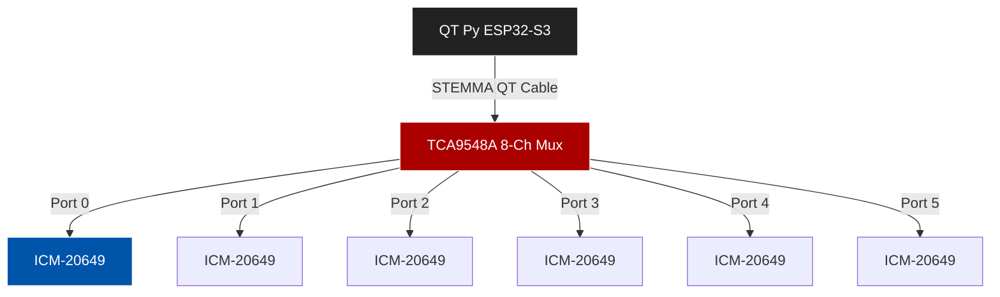

# Hardware Research: ESP32-S3 QT Py + ICM-20649 + STEMMA QT

**Date:** February 4, 2026  
**Subject:** Feasibility of chaining 6x ICM-20649 IMUs on a single ESP32-S3 QT Py via STEMMA QT

## 1. Executive Summary
**Can you daisy-chain 6 sensors directly?**  
🔴 **NO.** The ICM-20649 sensor only supports **2 unique I2C addresses** (0x68 and 0x69). You cannot connect more than 2 sensors to a single I2C bus without address conflicts.

**Is a Mux required?**  
🟢 **YES.** A multiplexer is strictly required to run 6 sensors.

**Recommended Solution:**  
Use a **STEMMA QT / Qwiic enabled 8-Channel Mux** (TCA9548A). This allows you to plug all 6 sensors into a central hub using standard cables, with no soldering.

---

## 2. Component Analysis

### A. Microcontroller: Adafruit QT Py ESP32-S3
*   **Processor:** Dual-core 240MHz Xtensa LX7.
*   **I2C Interfaces:**
    *   **Port 1 (Wire1):** Exposed on the **STEMMA QT connector** (SDA1/SCL1).
    *   **Port 0 (Wire):** Exposed on breakout pads (SDA/SCL).
*   **Voltage:** 3.3V Logic (Native).
*   **Pullups:** Internal pullups are weak. External pullups (on sensors/mux) are required (and provided by standard breakout boards).
*   **Capability:** Capable of driving I2C at 400kHz (Fast Mode) or up to 800kHz-1MHz (Fast Mode Plus) depending on bus capacitance.

### B. Sensor: Adafruit ICM-20649 (+ LIS3MDL)
*   **Interface:** I2C / SPI.
*   **I2C Addresses:**
    *   **Default:** `0x68`
    *   **Alternate:** `0x69` (Selectable locally via `AD0` jumper/pin).
*   **Constraint:** Since only **2** addresses are available, a maximum of 2 sensors can exist on a single shared bus line.
*   **Pullups:** Breakout boards include 10kΩ pullups on SDA/SCL.

### C. The Connection System (STEMMA QT / Qwiic)
*   **Cables:** 4-wire (3.3V, GND, SDA, SCL).
*   **Chaining:** While the *connectors* allow physical chaining, the *electrical protocol* (I2C) fails due to the address conflicts mentioned above.

---

## 3. The Solution: Multiplexing

To connect 6 sensors, you must split the main I2C bus into isolated sub-buses.

### Recommended Hardware: TCA9548A (STEMMA QT Version)
*   **Part:** **SparkFun Qwiic Mux Breakout - 8 Channel (TCA9548A)**
*   **Vendor Links:**
    *   [SparkFun ($16.95)](https://www.sparkfun.com/products/16784)
    *   [Adafruit (Reseller - PID 4704)](https://www.adafruit.com/product/4704)
*   **How it works:**
    *   Connects to QT Py via one STEMMA QT cable.
    *   Provides **8 output ports**.
    *   You connect each IMU to its own port (Ports 0-5).
    *   **Software:** You tell the Mux "Open Port 0", read IMU (at 0x68), then "Open Port 1", read IMU (at 0x68), etc.

### Topology Diagram

---

## 4. Bandwidth & Timing Feasibility (6 Sensors)

With a Multiplexer, you must send a "Switch Channel" command before every sensor read. This adds overhead.

**Transaction Loop (Per Sensor):**
1.  **Write Mux (2 bytes):** `[Addr 0x70] [Channel Mask]` (~50µs @ 400kHz)
2.  **Read IMU (Data):** Burst read Accel+Gyro (12 bytes) + Overhead (~350-400µs @ 400kHz)
3.  **Total per sensor:** ~450µs

**Total Frame Budget (6 Sensors):**
*   6 × 450µs = **2,700µs (2.7 ms)** for raw I2C comms.
*   **Processing:** +500µs (Quaternion/Fusion).
*   **Total Node Time:** ~3.2ms.

**Conclusion:**
*   This fits **EASILY** within your **8ms Slot** (TDMA Slot Minimum).
*   Even at standard **400kHz**, this topology is capable of **>250Hz** sampling per node.
*   **Recommendation:** Stick to **400kHz** I2C speed. With 6 cables and a Mux, 800kHz/1MHz might introduce noise/errors without strict cable management.

## 5. Summary of Required Parts
1.  **1x** Adafruit QT Py ESP32-S3
2.  **1x** SparkFun Qwiic Mux Breakout (TCA9548A)
3.  **6x** Adafruit ICM-20649 Breakouts
4.  **7x** STEMMA QT / Qwiic Cables (various lengths)

