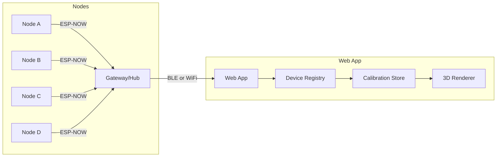

# Architecture — Full-Body ESP-NOW Biomechanics Suit

## Purpose
This document defines the physical and logical architecture of the full-body biomechanics suit, integrating the current working prototype with the V1 vision.

---

## Design Principles
- **Segment-based sensing** aligned with biomechanics best practice (OpenSense-style)
- **Distributed sampling** with deterministic timestamps
- **Minimal but strategic magnetometer usage** (one for heading reference)
- **Scalable node architecture** (V1 → V2 without redesign)
- **Direct BLE/WiFi connectivity** (no gateway initially; gateway is V2 roadmap)

---

## Current State (Prototype)
The current prototype uses a single ESP32-S3 node with 1-8 ICM20649 IMUs via I2C multiplexer.

### Hardware (Working)
| Component | Details |
|-----------|---------|
| MCU | Adafruit QT Py ESP32-S3 |
| IMUs | ICM20649 (6-DOF: ±16g accel, ±2000dps gyro) |
| Multiplexer | TCA9548A (up to 8 sensors) |
| Connectivity | BLE (primary), WiFi/WebSocket (secondary) |
| Status LED | NeoPixel (RGB) |

### Firmware Features (Working)
- Madgwick sensor fusion (on-board quaternion output)
- Configurable sample rates (30/60/120 Hz)
- JSON command protocol via BLE/WebSocket
- **Calibration persistence** (NVS save/load) ✓
- ZUPT drift correction (stationary detection)
- **Corrected Handedness**: Hardware-specific axis mapping applied (see [Coordinate Systems](coordinate_systems.md))

### Web App Features (Working)
- React + Three.js + Vite
- Mixamo skeleton (15 segments supported)
- T-pose calibration with quaternion offset calculation
- Multiple body templates (lower_body, full_body)
- Simulator for offline testing

---

## V1 Vision — Full-Body Suit

### Sensor Inventory (V1)
| Component | Qty | Notes |
|-----------|-----|-------|
| ICM20649 | 12 | 6-DOF IMUs |
| MMC5603 | 1 | Magnetometer (heading reference) |
| BMP390 | 1 | Barometer (altitude/jump detection) |
| ESP32-S3 | 4 | Sensor nodes |
| ESP32-S3 | 1 | Gateway (optional, V2) |

### Node Layout (V1)

```
┌─────────────────────────────────────────────────────────────────┐
│                         FULL BODY LAYOUT                        │
├─────────────────────────────────────────────────────────────────┤
│                                                                 │
│                            [HEAD]                               │
│                              │                                  │
│              ┌───────────────┼───────────────┐                  │
│              │               │               │                  │
│         [L_ARM]         [STERNUM*]      [R_ARM]                 │
│              │          + MMC5603       + BMP390                │
│              │          + BMP390            │                   │
│         [L_FOREARM]         │          [R_FOREARM]              │
│              │               │               │                  │
│                          [PELVIS]                               │
│                         /         \                             │
│                   [L_THIGH]    [R_THIGH]                        │
│                        │            │                           │
│                   [L_SHANK]    [R_SHANK]                        │
│                        │            │                           │
│                   [L_FOOT]     [R_FOOT]                         │
│                                                                 │
│  * STERNUM vs C7 (cervical): TBD based on skating posture      │
└─────────────────────────────────────────────────────────────────┘
```

### Node A — Upper Body Cluster
| Sensor | Segment | Mixamo Bone |
|--------|---------|-------------|
| ICM20649 #0 | torso | mixamorigSpine2 |
| ICM20649 #1 | upper_arm_l | mixamorigLeftArm |
| ICM20649 #2 | upper_arm_r | mixamorigRightArm |
| ICM20649 #3 | forearm_l | mixamorigLeftForeArm |
| ICM20649 #4 | forearm_r | mixamorigRightForeArm |
| MMC5603 | — | Heading reference for yaw correction |
| BMP390 | — | Altitude/jump detection |

### Node B — Lower Body Cluster
| Sensor | Segment | Mixamo Bone |
|--------|---------|-------------|
| ICM20649 #0 | pelvis | mixamorigHips |
| ICM20649 #1 | thigh_l | mixamorigLeftUpLeg |
| ICM20649 #2 | thigh_r | mixamorigRightUpLeg |
| ICM20649 #3 | shank_l | mixamorigLeftLeg |
| ICM20649 #4 | shank_r | mixamorigRightLeg |

### Node C — Left Boot
| Sensor | Segment | Mixamo Bone |
|--------|---------|-------------|
| ICM20649 | foot_l | mixamorigLeftFoot |

### Node D — Right Boot
| Sensor | Segment | Mixamo Bone |
|--------|---------|-------------|
| ICM20649 | foot_r | mixamorigRightFoot |

---

## V2 Expansion (Future)
- Klap skate blade angle sensors (ToF)
- Head IMU (mixamorigHead)
- Wrist IMUs (mixamorigLeftHand, mixamorigRightHand)
- ESP-NOW gateway for longer range
- Multi-person sync for team analysis

---

## Connectivity Options

### Option A: Direct Multi-Connect (V1 Preferred)
Each node advertises as separate BLE device. Web app connects to all 4 simultaneously.

**Pros**: Simpler firmware, no gateway needed
**Cons**: BLE limit (~3-4 simultaneous connections)

### Option B: ESP-NOW Hub (V2)
Nodes transmit via ESP-NOW to a gateway. Gateway bridges to BLE/WiFi.

**Pros**: Unlimited nodes, lower latency, longer range
**Cons**: More complexity, additional hardware

---

## Data Flow



---

## Key Firmware Files

| File | Purpose |
|------|---------|
| `IMUConnect.ino` | Main sketch, loop, command handling |
| `SensorManager.cpp` | IMU read, Madgwick fusion, calibration |
| `CommandHandler.cpp` | JSON command parsing |
| `BLEManager.cpp` | BLE advertising, data transmission |
| `SyncManager.cpp` | ESP-NOW time sync (multi-node) |

## Key Web App Files

| File | Purpose |
|------|---------|
| `useDeviceRegistry.ts` | Device state, auto-assignment, caches |
| `useCalibrationStore.ts` | T-pose capture, offset calculation |
| `SkeletonModel.tsx` | 3D rendering, bone updates |
| `boneMapping.ts` | Segment → Mixamo bone mapping |
| `BLEConnection.ts` | BLE GATT communication |
